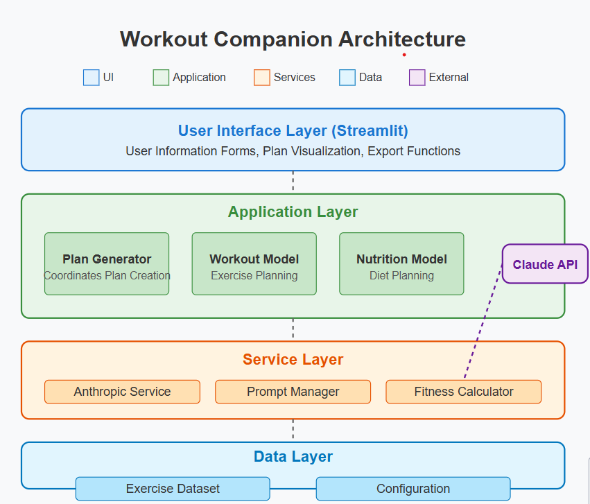

# Workout Companion

A comprehensive AI-powered fitness and nutrition planning application that generates personalized workout routines and meal plans based on individual user metrics, preferences, and goals.

## 🏋️ Overview

Workout Companion uses Anthropic's Claude AI to create highly personalized fitness and nutrition plans that account for:

- User's physical metrics (weight, height, BMI)
- Weight loss goals and timeframes
- Dietary preferences (vegetarian, vegan, non-vegetarian)
- Cuisine type preferences (Maharashtrian, South Indian, etc.)
- Available workout time
- Location-specific food recommendations

## 🔧 Architecture



The application is built with a modular architecture:

```
workout-companion/
├── config/                # Configuration management
│   ├── prompts.py         # AI prompt templates
│   └── settings.py        # Application settings
├── data/                  # Data management
│   ├── dataset.csv        # Exercise dataset
│   └── loader.py          # Data loading utilities
├── models/                # Core business logic
│   ├── ai_service.py      # Anthropic Claude API client
│   ├── plan_generator.py  # Coordinates plan generation
│   ├── workout.py         # Workout plan generation
│   └── nutrition.py       # Nutrition plan generation
├── ui/                    # User interface components
│   ├── components.py      # UI elements
│   ├── styles.py          # Custom CSS
│   └── visualization.py   # Data visualization
├── utils/                 # Utility functions
│   ├── calculators.py     # Fitness calculations (BMI, TDEE)
│   ├── logger.py          # Logging configuration
│   └── validators.py      # Input validation
└── main.py                # Application entry point
```

### Key Components

1. **User Interface (Streamlit)**
   - Collects user information through intuitive forms
   - Visualizes generated plans with interactive charts
   - Allows export of plans in various formats

2. **Plan Generation**
   - Calculates calorie needs based on user metrics and goals
   - Generates workouts optimized for calorie burn within time constraints
   - Creates nutrition plans based on dietary preferences and cuisine type

3. **AI Integration**
   - Uses Anthropic's Claude for intelligent plan generation
   - Structured prompt system for consistent, high-quality outputs
   - Efficient caching system to reduce API costs

4. **Data Processing**
   - Pre-processes exercise dataset for optimal recommendations
   - Calculates exercise efficiency (calories/minute)
   - Enforces time and safety constraints

## ⚙️ Technical Details

### System Requirements

- Python 3.9+
- Streamlit 1.10+
- Pandas, NumPy, Plotly for data processing and visualization
- Anthropic API key

### Key Technologies

- **Streamlit**: Front-end web application framework
- **Anthropic Claude API**: Powers the AI-driven plan generation
- **Pandas/NumPy**: Data processing and analysis
- **Plotly**: Interactive data visualizations

### Parallel Processing

The application implements concurrent processing to generate workout and nutrition plans simultaneously, reducing overall response time.

### Caching Mechanisms

- Exercise data is cached to improve performance
- AI responses are cached based on input parameters to reduce API calls
- Streamlit session state maintains user context

## 🚀 Getting Started

### Prerequisites

1. Python 3.9 or higher
2. Anthropic API key

### Installation

```bash
# Clone the repository
git clone https://github.com/yourusername/workout-companion.git
cd workout-companion

# Install dependencies
pip install -r requirements.txt

# Set up environment variables
echo "ANTHROPIC_KEY=your_api_key_here" > .env
```

### Running the Application

```bash
streamlit run main.py
```

The application will be available at http://localhost:8501

## 🔑 Configuration

### Environment Variables

- `ANTHROPIC_KEY`: Your Anthropic API key
- `AI_MODEL`: Claude model to use (default: claude-3-haiku-20240307)
- `API_MAX_TOKENS`: Maximum tokens for API response (default: 4000)
- `API_TEMPERATURE`: Temperature setting for Claude (default: 0)

### Custom Exercise Data

You can replace the default exercise dataset with your own by:

1. Following the same format as `data/dataset.csv`
2. Setting the `DATASET_PATH` environment variable to point to your file

## 📋 Features

- **BMI-based Workout Recommendations**: Adapts exercises based on user's BMI category
- **Time-Constrained Workouts**: Strictly enforces user's available time
- **Culturally-Relevant Nutrition**: Tailors meal plans to preferred cuisine types
- **Location-Aware Food Recommendations**: Suggests locally available ingredients
- **Comprehensive Visualizations**: Charts for weight loss trajectory, macronutrient distribution
- **Exportable Plans**: JSON export with PDF coming soon

## 🛠️ Development

### Adding New Exercise Types

To add new exercises to the dataset:

1. Add a new row to `data/dataset.csv` with the following information:
   - `id`: Unique identifier
   - `name`: Exercise name
   - `total_time`: Total time including setup (minutes)
   - `exercise_duration`: Actual exercise time (minutes)
   - `met_value`: Metabolic Equivalent of Task value
   - `calories_burned_per_kg`: Calories burned per kg of body weight

### Customizing Prompts

Modify the prompt templates in `config/prompts.py` to adjust how the AI generates plans. The system uses a versioned prompt management system to allow A/B testing of different prompt strategies.

## 📝 License

This project is licensed under the MIT License - see the LICENSE file for details.

## 🔮 Roadmap

- [ ] Add progress tracking functionality
- [ ] Implement exercise video demonstrations
- [ ] Add PDF export functionality
- [ ] Incorporate user feedback mechanism for plan refinement
- [ ] Develop mobile application version
